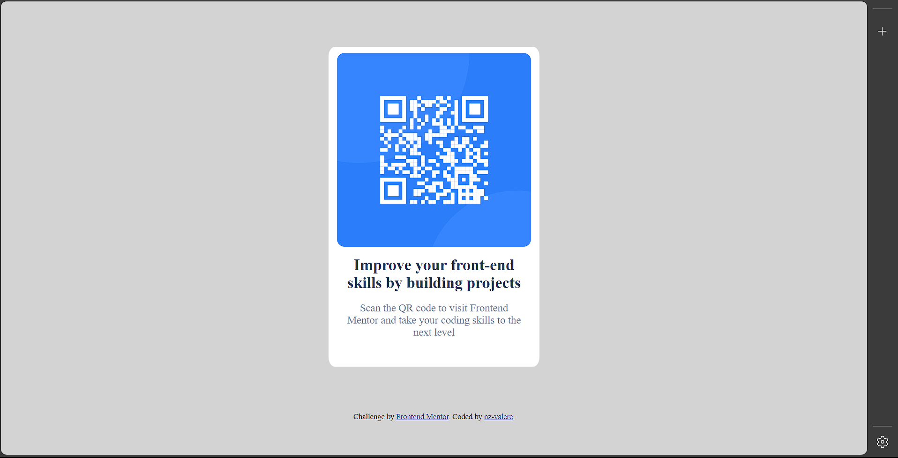

# Frontend Mentor - QR code component solution

This is a solution to the [QR code component challenge on Frontend Mentor](https://www.frontendmentor.io/challenges/qr-code-component-iux_sIO_H). Frontend Mentor challenges help you improve your coding skills by building realistic projects. 

## Table of contents

- [Overview](#overview)
  - [Screenshot](#screenshot)
  - [Links](#links)
- [My process](#my-process)
  - [Built with](#built-with)
  - [What I learned](#what-i-learned)
  - [Useful resources](#useful-resources)
- [Author](#author)
- [Acknowledgments](#acknowledgments)

## Overview

### Screenshot

### Links

- Solution URL: [Add solution URL here](https://github.com/nz-valere/qr-component)
- Live Site URL: [Add live site URL here](https://nz-valere.github.io/qr-component/)

## My process

### Built with

- Semantic HTML5 markup
- CSS custom properties

### Useful resources

- [Meduim](https://medium.com/frontend-mentor/a-complete-guide-to-submitting-solutions-on-frontend-mentor-ac6384162248) - This helped me in hosting this website. I really liked this pattern and will use it going forward.

## Author

- Website - [KENGNI VALERE](https://github.com/nz-valere)
- Frontend Mentor - [@nz-valere](https://www.frontendmentor.io/profile/nz-valere)

## Acknowledgments

I wanted to take a moment to express my gratitude to a friend for an invaluable support and assistance throughout my development project. Your dedication and willingness to lend a helping hand have been instrumental in making this endeavor a success.

Your expertise have not only enriched the project but have also greatly contributed to my growth as a developer. I truly appreciate the time and effort you've invested, and I am immensely grateful to have you as a friend and collaborator.

Thank you once again for your unwavering support and belief in our vision. I look forward to many more fruitful collaborations in the future.